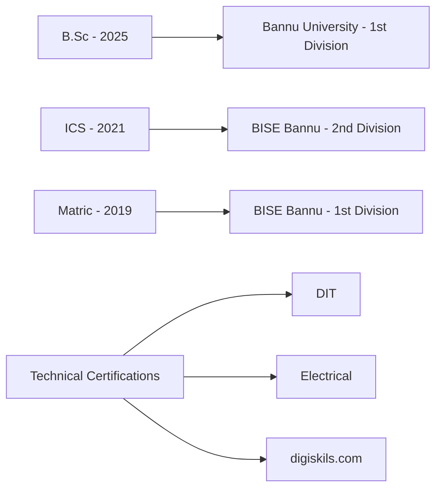

# 🚀 Muhib Ullah

<a href="https://muhibkhan123.github.io/My-CV/">MY CV</a>

## 💫 Developer

> "Building tomorrow's solutions with today's code"

Passionate technologist with deep expertise across multiple domains, seeking to leverage my diverse technical arsenal in an innovative organization that values creativity and technical excellence. My mission is to transform complex business problems into elegant digital solutions while continuously expanding my technological horizons.

```javascript
const muhibProfile = {
  location: "Bannu, Pakistan",
  contact: {
    email: "muhib7199@gmail.com",
    phone: ["0313-9242996", "0334-3737061"]
  },
  domains: ["Development", "Automation Engineering", "Database Architecture", "UX Design"],
  personalDetails: {
    dob: "june 15, 2004",
    nationality: "Pakistani",
    religion: "Islam",
    maritalStatus: "Un Married"
  },
  currentFocus: "Developing intelligent automation solutions for enterprise workflows"
};
```


## 🛠️ Technical Arsenal

### 💻 Development

### 🤖 Automation

### 🗃️ Databases

### 🎨 Design

### 🖥️ Office Productivity

## 🎓 Education \& Certifications




### Professional Skills

- **Leadership**: Project management and team coordination experience
- **Problem-Solving**: Analytical approach to technical challenges
- **Team Collaboration**: Effective communication in diverse work environments
- **Time Management**: Prioritization and deadline management
- **Adaptability**: Quick learning and adaptation to new technologies


## 🌐 Languages

| Language | Reading | Writing | Speaking | Typing |
| :-- | :--: | :--: | :--: | :--: |
| English | ✓ | ✓ | ✓ | ✓ |
| Urdu | ✓ | ✓ | ✓ | ✓ |
| Pashto | ✓ | ✓ | ✓ | ✓ |


## 📊 GitHub Analytics

## 📫 Connect With Me


<div align="center">
    <div>
        <a href="mailto:muhib7196@gmail.com"></a>
        <a href="https://github.com/muhibkhan123"></a>
        <a href="https://www.linkedin.com/in/muhib-ullah-62663723b/"></a>
        <a href="https://www.instagram.com/itx______muhibullah/"></a>
        <a href="https://www.facebook.com/Muhibedtix"></a>
        <a href="https://www.tiktok.com/@muhib__afghani"></a>
        <a href="https://www.youtube.com/@muhibedtix3370"></a>
    </div>
    
</div>
<p align="center">
  📱 Phone: 0313-9242996 / 0334-3737061
</p>
<p align="center">
  
</p>

---

<p align="center">
  <i>Address: Village Khurrgai P/O & Tehsil Domel Distt. Bannu, Pakistan</i>
</p>


<div align="center">
  
  <h1>Muhib Ullah 🇵🇰</h1>
 
  <p>
    📍 Village khurrgai, Domel, Bannu, Pakistan <br />
    📧 <a href="mailto:muhib7199@gmail.com">muhib7199@gmail.com</a> | 📞 +92-313-9242996 / +92-334-3737061
  </p>
</div>

---

## 🚀 About Me

I am a passionate and results-driven **Computer Enthusiast & Software Developer** with a relentless drive for innovation and a deep-seated commitment to lifelong learning. My journey in technology is fueled by a desire to architect and implement solutions that are not only efficient but also transformative. I thrive in dynamic environments where I can leverage my diverse technical skill set to contribute to groundbreaking projects and continuously push the boundaries of what's possible. My objective is to channel my expertise into an organization that values creativity, fosters growth, and dares to shape the future.

---

## 🤝 The Human Element: Soft Skills

Beyond the code and algorithms, I bring a suite of soft skills crucial for collaborative success:

*   **Leadership & Initiative:** Proven through entrepreneurial ventures and managing key responsibilities in government projects.
*   **Strategic Problem-Solving:** Adept at dissecting complex issues and engineering innovative, effective solutions.
*   **Agile Collaboration:** Seamlessly integrate with teams, fostering a positive and productive work environment.
*   **Effective Time Management:** Juggling multiple projects and stringent deadlines with precision and efficiency.
*   **Adaptability & Resilience:** Thriving in diverse and challenging environments, from startups to large government bodies.
*   **Stellar Communication:** Articulating technical concepts clearly to both technical and non-technical audiences.

---
## 🎓 Academic Foundation

*   **B.Sc(software engineering)** - Bannu University (2025) - *1st Division*
*   **ICS** - BISE Bannu (2021) - *2nd Division*
*   **Matric** - BISE Bannu (2019) - *1st Division*

---
## 🌐 Languages

*   **English:** Fluent (Read, Write, Speak, Type)
*   **Urdu:** Native (Read, Write, Speak, Type)
*   **Pashto:** Native (Read, Write, Speak, Type)

---

## ✨ Let's Build the Future Together!

I'm always excited to connect with fellow innovators, explore new challenges, and collaborate on projects that make a difference. Feel free to reach out via email!

<div align="center">
  <p>
     Muhib Ullah | All Rights Reserved
  </p>
</div>
